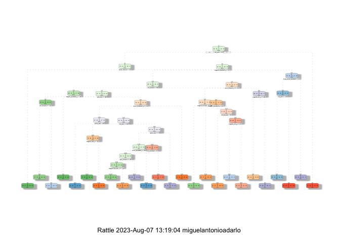

Course Project: Practical Machine Learning
================
Miguel Adarlo
2023-08-07

## Introduction

With the rise of wearable fitness trackers such as Jawbone Up, Nike
FuelBand, and Fitbit, it is possible to obtain data regarding personal
activity. The goal of this project is to determine the exercise done
from data picked up by accelerometers attached to the belt, forearm,
arm, and dumbells.

## Data Loading

``` r
library(caret)
library(rpart)
library(rpart.plot)
library(randomForest)
library(corrplot)
library(rattle)
library(gbm)
```

``` r
trainUrl <-"https://d396qusza40orc.cloudfront.net/predmachlearn/pml-training.csv"
testUrl <- "https://d396qusza40orc.cloudfront.net/predmachlearn/pml-testing.csv"
trainFile <- "./pml-training.csv"
testFile  <- "./pml-testing.csv"
if (!file.exists(trainFile)) {
  download.file(trainUrl, destfile=trainFile, method="curl")
}
if (!file.exists(testFile)) {
  download.file(testUrl, destfile=testFile, method="curl")
}
```

``` r
trainSet <- read.csv("pml-training.csv")
testSet <- read.csv("pml-testing.csv")
dim(trainSet)
```

    ## [1] 19622   160

``` r
dim(testSet)
```

    ## [1]  20 160

First, the libraries were loaded and the required data for the project
were downloaded. Afterwards, the datasets were loaded into DataFrames.
From the dimensions of the datasets, the training set has 19622 entries,
with 160 fields. The test set, meanwhile, has 20 entries, with 160
fields.

## Data Cleaning

Not all of the variables within the datasets are needed for analysis, so
the following steps were done to preprocess the datasets for modeling.

First, the first 7 columns were removed, as they contained fields not
important to modeling, such as indices, username, raw timestamps, and
windows.

``` r
trainSet <- trainSet[,-c(1:7)]
testSet <- testSet[,-c(1:7)]
dim(trainSet)
```

    ## [1] 19622   153

``` r
dim(testSet)
```

    ## [1]  20 153

Then, columns that contained NA values were removed.

``` r
trainSet <- trainSet[, colSums(is.na(trainSet)) == 0] 
testSet <- testSet[, colSums(is.na(testSet)) == 0] 
dim(trainSet)
```

    ## [1] 19622    86

``` r
dim(testSet)
```

    ## [1] 20 53

Following that, columns that were not related to the accelerometer
measurements, such as timestamps and such, were removed. Columns that
were not numeric were also removed, though classe had to be preserved as
it is the response variable.

``` r
classe <- trainSet$classe
trainRemove <- grepl("^X|timestamp|window", names(trainSet))
trainSet <- trainSet[, !trainRemove]
trainProcessed <- trainSet[, sapply(trainSet, is.numeric)]
trainProcessed$classe <- classe #Have to re-add that back in.

testRemove <- grepl("^X|timestamp|window", names(testSet))
testSet <- testSet[, !testRemove]
testProcessed <- testSet[, sapply(testSet, is.numeric)]

colnames(trainProcessed)
```

    ##  [1] "roll_belt"            "pitch_belt"           "yaw_belt"            
    ##  [4] "total_accel_belt"     "gyros_belt_x"         "gyros_belt_y"        
    ##  [7] "gyros_belt_z"         "accel_belt_x"         "accel_belt_y"        
    ## [10] "accel_belt_z"         "magnet_belt_x"        "magnet_belt_y"       
    ## [13] "magnet_belt_z"        "roll_arm"             "pitch_arm"           
    ## [16] "yaw_arm"              "total_accel_arm"      "gyros_arm_x"         
    ## [19] "gyros_arm_y"          "gyros_arm_z"          "accel_arm_x"         
    ## [22] "accel_arm_y"          "accel_arm_z"          "magnet_arm_x"        
    ## [25] "magnet_arm_y"         "magnet_arm_z"         "roll_dumbbell"       
    ## [28] "pitch_dumbbell"       "yaw_dumbbell"         "total_accel_dumbbell"
    ## [31] "gyros_dumbbell_x"     "gyros_dumbbell_y"     "gyros_dumbbell_z"    
    ## [34] "accel_dumbbell_x"     "accel_dumbbell_y"     "accel_dumbbell_z"    
    ## [37] "magnet_dumbbell_x"    "magnet_dumbbell_y"    "magnet_dumbbell_z"   
    ## [40] "roll_forearm"         "pitch_forearm"        "yaw_forearm"         
    ## [43] "total_accel_forearm"  "gyros_forearm_x"      "gyros_forearm_y"     
    ## [46] "gyros_forearm_z"      "accel_forearm_x"      "accel_forearm_y"     
    ## [49] "accel_forearm_z"      "magnet_forearm_x"     "magnet_forearm_y"    
    ## [52] "magnet_forearm_z"     "classe"

``` r
colnames(testProcessed)
```

    ##  [1] "roll_belt"            "pitch_belt"           "yaw_belt"            
    ##  [4] "total_accel_belt"     "gyros_belt_x"         "gyros_belt_y"        
    ##  [7] "gyros_belt_z"         "accel_belt_x"         "accel_belt_y"        
    ## [10] "accel_belt_z"         "magnet_belt_x"        "magnet_belt_y"       
    ## [13] "magnet_belt_z"        "roll_arm"             "pitch_arm"           
    ## [16] "yaw_arm"              "total_accel_arm"      "gyros_arm_x"         
    ## [19] "gyros_arm_y"          "gyros_arm_z"          "accel_arm_x"         
    ## [22] "accel_arm_y"          "accel_arm_z"          "magnet_arm_x"        
    ## [25] "magnet_arm_y"         "magnet_arm_z"         "roll_dumbbell"       
    ## [28] "pitch_dumbbell"       "yaw_dumbbell"         "total_accel_dumbbell"
    ## [31] "gyros_dumbbell_x"     "gyros_dumbbell_y"     "gyros_dumbbell_z"    
    ## [34] "accel_dumbbell_x"     "accel_dumbbell_y"     "accel_dumbbell_z"    
    ## [37] "magnet_dumbbell_x"    "magnet_dumbbell_y"    "magnet_dumbbell_z"   
    ## [40] "roll_forearm"         "pitch_forearm"        "yaw_forearm"         
    ## [43] "total_accel_forearm"  "gyros_forearm_x"      "gyros_forearm_y"     
    ## [46] "gyros_forearm_z"      "accel_forearm_x"      "accel_forearm_y"     
    ## [49] "accel_forearm_z"      "magnet_forearm_x"     "magnet_forearm_y"    
    ## [52] "magnet_forearm_z"     "problem_id"

``` r
dim(trainProcessed)
```

    ## [1] 19622    53

``` r
dim(testProcessed)
```

    ## [1] 20 53

After the removal of columns, both the training and test sets have 53
fields, with the training set having classe as its response variable.

## Data Splitting

As the datasets have been preprocessed, they can now be split into train
and validation sets. The train set was split into a training set
containing 70% of the training data, and a validation set containing 30%
of the test data.

``` r
set.seed(22519) # For reproducibile purpose
inTrain <- createDataPartition(trainProcessed$classe, p=0.70, list=F)
trainData <- trainProcessed[inTrain, ]
testData <- trainProcessed[-inTrain, ] #Different from TestProcessed earlier
dim(trainData)
```

    ## [1] 13737    53

``` r
dim(testData)
```

    ## [1] 5885   53

## Data Modeling

To then build the model to predict the manner the exercise was done,
three models were compared: Decision Tree, Generalized Boosted Model
(GBM), and a Random Forest. To get the metrics to compare each,
confusion matrices were used.

### Decision Tree

``` r
set.seed(0)
exerciseDT <- rpart(classe ~ ., data = trainData, method="class")
fancyRpartPlot(exerciseDT)
```

    ## Warning: labs do not fit even at cex 0.15, there may be some overplotting

<!-- -->

Performance of the Decision Tree:

``` r
predictDT <- predict(exerciseDT, newdata = testData, type="class")
confusionMatrixDT <- confusionMatrix(predictDT, as.factor(testData$classe))
confusionMatrixDT
```

    ## Confusion Matrix and Statistics
    ## 
    ##           Reference
    ## Prediction    A    B    C    D    E
    ##          A 1502  162   24   60   18
    ##          B   62  674   78   87   99
    ##          C   44  159  825   74   92
    ##          D   52   76   70  660   71
    ##          E   14   68   29   83  802
    ## 
    ## Overall Statistics
    ##                                           
    ##                Accuracy : 0.7584          
    ##                  95% CI : (0.7472, 0.7693)
    ##     No Information Rate : 0.2845          
    ##     P-Value [Acc > NIR] : < 2.2e-16       
    ##                                           
    ##                   Kappa : 0.6939          
    ##                                           
    ##  Mcnemar's Test P-Value : < 2.2e-16       
    ## 
    ## Statistics by Class:
    ## 
    ##                      Class: A Class: B Class: C Class: D Class: E
    ## Sensitivity            0.8973   0.5917   0.8041   0.6846   0.7412
    ## Specificity            0.9373   0.9313   0.9241   0.9453   0.9596
    ## Pos Pred Value         0.8505   0.6740   0.6910   0.7104   0.8052
    ## Neg Pred Value         0.9582   0.9048   0.9572   0.9387   0.9427
    ## Prevalence             0.2845   0.1935   0.1743   0.1638   0.1839
    ## Detection Rate         0.2552   0.1145   0.1402   0.1121   0.1363
    ## Detection Prevalence   0.3001   0.1699   0.2029   0.1579   0.1692
    ## Balanced Accuracy      0.9173   0.7615   0.8641   0.8150   0.8504

The accuracy of the Decision Tree is 0.7584, with its generalization
error (out-of-sample error) being 0.2416.

### Generalized Boosted Model (GBM)

``` r
set.seed(0)
controlGBM <- trainControl(method = "repeatedcv", number = 5, repeats = 2)
exerciseGBM  <- train(classe ~ ., data = trainData, method = "gbm",
                  trControl = controlGBM, verbose = FALSE)
exerciseGBM$finalModel
```

    ## A gradient boosted model with multinomial loss function.
    ## 150 iterations were performed.
    ## There were 52 predictors of which 52 had non-zero influence.

Performance of the Generalized Boosted Model (GBM):

``` r
predictGBM <- predict(exerciseGBM, newdata = testData)
confusionMatrixGBM <- confusionMatrix(predictGBM, as.factor(testData$classe))
confusionMatrixGBM
```

    ## Confusion Matrix and Statistics
    ## 
    ##           Reference
    ## Prediction    A    B    C    D    E
    ##          A 1652   39    0    1    0
    ##          B    8 1076   21    4    9
    ##          C   11   23  990   27    9
    ##          D    3    1   13  925   21
    ##          E    0    0    2    7 1043
    ## 
    ## Overall Statistics
    ##                                           
    ##                Accuracy : 0.9662          
    ##                  95% CI : (0.9612, 0.9707)
    ##     No Information Rate : 0.2845          
    ##     P-Value [Acc > NIR] : < 2.2e-16       
    ##                                           
    ##                   Kappa : 0.9572          
    ##                                           
    ##  Mcnemar's Test P-Value : NA              
    ## 
    ## Statistics by Class:
    ## 
    ##                      Class: A Class: B Class: C Class: D Class: E
    ## Sensitivity            0.9869   0.9447   0.9649   0.9595   0.9640
    ## Specificity            0.9905   0.9912   0.9856   0.9923   0.9981
    ## Pos Pred Value         0.9764   0.9624   0.9340   0.9605   0.9914
    ## Neg Pred Value         0.9948   0.9868   0.9925   0.9921   0.9919
    ## Prevalence             0.2845   0.1935   0.1743   0.1638   0.1839
    ## Detection Rate         0.2807   0.1828   0.1682   0.1572   0.1772
    ## Detection Prevalence   0.2875   0.1900   0.1801   0.1636   0.1788
    ## Balanced Accuracy      0.9887   0.9679   0.9753   0.9759   0.9810

The accuracy of the Generalized Boosted Model is 0.9662, with its
generalization error (out-of-sample error) being 0.0338.

### Random Forest

``` r
set.seed(0)
controlRF <- trainControl(method = "repeatedcv", number = 5, repeats = 2)
exerciseRF  <- train(classe ~ ., data = trainData, method = "rf",
                 trControl = controlRF, verbose = FALSE)
exerciseRF$finalModel
```

    ## 
    ## Call:
    ##  randomForest(x = x, y = y, mtry = param$mtry, verbose = FALSE) 
    ##                Type of random forest: classification
    ##                      Number of trees: 500
    ## No. of variables tried at each split: 27
    ## 
    ##         OOB estimate of  error rate: 0.64%
    ## Confusion matrix:
    ##      A    B    C    D    E class.error
    ## A 3902    3    0    0    1 0.001024066
    ## B   19 2634    4    1    0 0.009029345
    ## C    0   11 2377    8    0 0.007929883
    ## D    0    2   21 2225    4 0.011989343
    ## E    0    2    3    9 2511 0.005544554

Performance of the Random Forest:

``` r
predictRF <- predict(exerciseRF, newdata = testData)
confusionMatrixRF <- confusionMatrix(predictRF, as.factor(testData$classe))
confusionMatrixRF
```

    ## Confusion Matrix and Statistics
    ## 
    ##           Reference
    ## Prediction    A    B    C    D    E
    ##          A 1670    4    0    0    0
    ##          B    1 1131    4    0    0
    ##          C    3    3 1020   12    4
    ##          D    0    1    2  952    2
    ##          E    0    0    0    0 1076
    ## 
    ## Overall Statistics
    ##                                           
    ##                Accuracy : 0.9939          
    ##                  95% CI : (0.9915, 0.9957)
    ##     No Information Rate : 0.2845          
    ##     P-Value [Acc > NIR] : < 2.2e-16       
    ##                                           
    ##                   Kappa : 0.9923          
    ##                                           
    ##  Mcnemar's Test P-Value : NA              
    ## 
    ## Statistics by Class:
    ## 
    ##                      Class: A Class: B Class: C Class: D Class: E
    ## Sensitivity            0.9976   0.9930   0.9942   0.9876   0.9945
    ## Specificity            0.9991   0.9989   0.9955   0.9990   1.0000
    ## Pos Pred Value         0.9976   0.9956   0.9789   0.9948   1.0000
    ## Neg Pred Value         0.9991   0.9983   0.9988   0.9976   0.9988
    ## Prevalence             0.2845   0.1935   0.1743   0.1638   0.1839
    ## Detection Rate         0.2838   0.1922   0.1733   0.1618   0.1828
    ## Detection Prevalence   0.2845   0.1930   0.1771   0.1626   0.1828
    ## Balanced Accuracy      0.9983   0.9960   0.9948   0.9933   0.9972

The accuracy of the Random Forest is 0.9939, with its generalization
error (out-of-sample error) being 0.0061.

## Conclusion and Predictions

Of the three models, the best performing model is the Random Forest
Model, with an accuracy of 0.9939 and a generalization error
(out-of-sample error) being 0.0061.

This model is then used to predict the labels of the test set.

``` r
predictRFTest <- predict(exerciseRF, subset(testProcessed, select = -c(problem_id))) #Remove problem_id
predictRFTest
```

    ##  [1] B A B A A E D B A A B C B A E E A B B B
    ## Levels: A B C D E

## Acknowledgement:

Data came from:
<http://web.archive.org/web/20161224072740/http:/groupware.les.inf.puc-rio.br/har>
